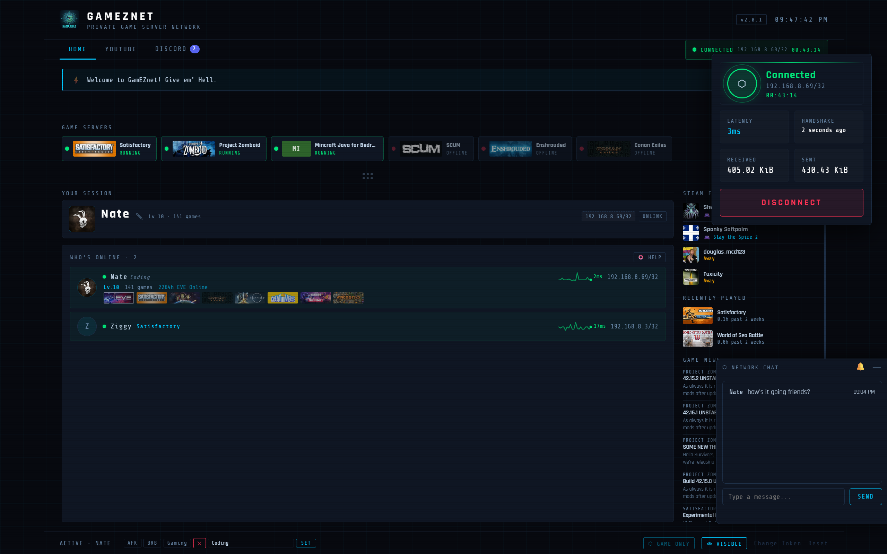

# GamezNET

**Private game server network — secure, invite-only, one command to join.**



---

## What is GamezNET?

GamezNET lets a group of friends connect to a private game server as if they were all on the same local network — no port forwarding, no public IP exposure, no tech skills required.

Under the hood it uses **WireGuard**, one of the fastest and most secure VPN protocols available. When you connect through GamezNET, your PC joins a private encrypted tunnel directly to the game server. From there you can play any game hosted on that server just like you were sitting in the same room.

**For players:** you get a one-time invite token from the admin, run a single install command, and you're done. The app sits in your system tray and connecting is one click.

**For the admin:** you control exactly who's in. Each player gets a unique token tied to their VPN credentials. Tokens can be revoked, and the server IP stays hidden from everyone — only the tunnel knows where it goes.

> **Windows Only** — GamezNET is designed exclusively for Windows 10/11. The app and installer will not work on macOS or Linux.

---

## ⚡ Install

Press **Win + R**, type `powershell`, and hit Enter. Paste this and hit Enter:

```powershell
irm https://gameznet.looknet.ca/install | iex
```

> **What does that command do?**
> `irm` (Invoke-RestMethod) downloads the GamezNET installer script from our server.
> `iex` (Invoke-Expression) runs it. This is the standard one-liner pattern for Windows app installers —
> the same method used by tools like Chocolatey and Scoop.
> You can inspect the script yourself by pasting just the `irm ...` part into your browser.

> Windows will ask for Administrator access — click **Yes**. The VPN needs it to create the secure tunnel.

*The installer handles everything automatically:*

- 📥 Downloads the GamezNET app
- 🐍 Installs Python if missing
- 🔒 Installs WireGuard VPN if missing
- 🖥️ Creates a GamezNET shortcut on your desktop and Start Menu

When it finishes, the app opens in your browser automatically.

---

## 🔑 First-Time Setup

1. Enter the invite token the admin sent you
2. Click **Activate Token** — your credentials are saved permanently
3. Click **Connect to Server**
4. Launch your game

That's it. You won't need the token again.

---

## 🎮 Daily Use

1. Double-click **GamezNET** on your desktop
2. Click **Connect to Server**
3. Play

When you're done, click **Disconnect** in the app or right-click the system tray icon. The VPN tunnel closes cleanly.

You'll get a **system tray notification** when a friend joins or leaves the network while you're connected, and when the admin posts a broadcast alert.

---

## 🖥️ Game Servers

The **Home** tab shows live status for all hosted game servers. Running servers display CPU load, RAM usage, and uptime. Each server card has:

- **IP ⧉** — click to copy the IP address alone (for games that ask for IP without a port)
- **:Port ⧉** — click to copy the full `IP:Port`
- **▶ STEAM JOIN** — launches Steam and connects directly to the server

---

## 📅 Scheduled Sessions

The **Home** tab shows the next scheduled game session when one is active. It displays the game name, host, scheduled time, message, and a live countdown. Sessions auto-expire 2 hours after the scheduled start time.

The admin can schedule a session from the **+ Schedule Session** button below the session card. Players get a system tray notification when a new session is posted.

---

## 🎙️ Discord

The **Home** tab includes a live **gamEZnet Discord** panel showing:

- Member list with avatars and voice channel activity
- Online and total member counts, refreshed every 30 seconds
- **Join Discord** button

---

## 📺 YouTube

The **YouTube** tab lets you browse and watch gaming videos without leaving the app.

- **Categories** — curated video feeds for the games we play: EVE Online, Project Zomboid, Satisfactory, Monster Hunter, Final Fantasy, Conan Exiles, Enshrouded, World of Sea Battle, World of Tanks, Tarkov, League of Legends, and chill music
- **Search** — search YouTube directly from the app; your last 5 searches are remembered
- **Sign in with Google** — sign in to unlock **My Feed**, a personalised stream of recent uploads from your subscribed channels. Your session persists across restarts.
- **Floating pop-out player** — detach any video into a draggable, resizable window that stays open while you switch tabs
- **Theater mode** — full-width immersive view for focused watching

---

## 💬 Player Status

Set a custom status visible to everyone on the network. Use the preset buttons (**AFK**, **BRB**, **Gaming**) or type your own message. Your status appears next to your name in the online player list. Your status is saved locally and restored automatically after an app update or restart.

---

## ✏️ Changing Your Name

Click the **✎** icon next to your name in the **Your Session** card to open the rename dialog. Enter a new name (2–24 characters, letters/numbers/spaces/dashes only) and click **Save**. The change is validated against your VPN identity server-side and takes effect immediately.

---

## 🛠️ Troubleshooting

**App didn't open after installing**
Run the install command again — it's safe to repeat and will fix most environment problems.

**"Python not found" when launching**
Run the install command again. It detects what's missing and fixes it automatically.

**"Invalid token"**
Make sure the token was copied exactly, dashes included — they look like `XXXX-XXXX-XXXX-XXXX`. Contact the admin if it still won't activate.

**"Token already redeemed"**
Your token was already used. Contact the admin to get a new one.

**Need to enter a new token**
Click **Change Token** in the bottom-right corner of the app.

**Browser didn't open automatically**
Go to `http://gameznet.local:7734` in any browser.

**Connected but can't reach the game server**
Wait 10 seconds after connecting and try again. If it keeps failing, let the admin know.

**Update required / version badge flashing**
Click the version badge in the top-right corner of the app — it will download and apply the update automatically, then restart. If that doesn't work, run the install command again.

---

## 🤝 Need Help?

Message the server admin. Running the install command again solves 99% of issues.

---

<details>
<summary>⚙️ Admin & Developer Reference</summary>

### Architecture

| Component | Role |
|---|---|
| Node.js/Express backend | Token management, API, install script delivery, YouTube/Discord/Steam proxy |
| SQLite | Persistent storage for tokens, settings, players, sessions |
| Docker Swarm | Backend deployment and orchestration |
| Traefik | Reverse proxy routing all `*.looknet.ca` traffic |
| Cloudflare Tunnel | Secure public exposure without open ports |
| Flask (gameznet.local:7734) | Local app server running on the user's PC |
| WireGuard | The secure VPN tunnel |
| Pterodactyl + Wings | Game server management and console |
| YouTube Data API v3 | Server-side video category browsing (30-min cache) |
| YouTube OAuth2 | Sign in with Google for personalised feed |
| Discord Bot API v10 | Live member list, online counts, voice activity, and alert/support notifications |
| Steam Web API | Game detection via player summaries |

### Requirements

- **Client:** Windows 10 or 11 (64-bit), internet connection
- **Server:** Docker Swarm cluster, Traefik reverse proxy, Cloudflare Tunnel

### Adding a Player

1. On your router/server, add them as a WireGuard peer
2. Assign a VPN IP and generate a keypair
3. Open the **Admin Panel** at `https://gameznet.looknet.ca/admin`
4. Enter their name, VPN IP, private key, and optional Steam ID → **Generate Token**
5. Send them the token and the install command

### Admin Panel — Configuration

The **Configuration** card has two tabs:

**Settings tab** — WireGuard endpoint, public key, allowed IPs, local gateway, and minimum required client version. Also contains UDM SSH settings for automatic peer provisioning.

**Integrations tab** — API credentials stored securely in the database:

| Field | Description |
|---|---|
| YouTube API Key | YouTube Data API v3 key — enables category browsing and search |
| OAuth Client ID | Google OAuth 2.0 client ID — enables Sign in with Google |
| OAuth Client Secret | Google OAuth 2.0 client secret |
| Discord Bot Token | Bot token for the gamEZnet Discord server |
| Alerts Channel ID | Discord channel ID for server start/stop notifications |
| Support Channel ID | Private Discord channel for player support request notifications |
| Steam API Key | Steam Web API key — enables game detection via Steam |

### Admin Panel — Incident Reports

The **Incident Reports** section shows player-submitted error reports. Each report has a **Dismiss** button to mark it read, and a **Clear all from [player]** button to delete every report from that player at once. Reports are rate-limited to one per 5 minutes per player.

### Admin Panel — Messages

The **Messages** card lets the admin post a **Message of the Day** (shown in the banner on every client) and a timed **Broadcast Alert** (shown as a coloured banner and triggers a tray notification on all connected clients).

### Admin Panel — Session Scheduler

Schedule a game session from the **Sessions** card. Pick a game (populated from running servers with Steam artwork), set a date/time and optional message, and post. All clients see the countdown card and receive a tray notification. Sessions auto-expire 2 hours after the scheduled start time.

### Deploying Updates

```bash
# On swarm-mgr-01
deploy-gameznet
```

The deploy script pulls the latest code on gamez-vm, rebuilds the Docker image with `--no-cache`, and rolls out the stack.

### Environment Variables

All variables are loaded from `/etc/gameznet/.env` at deploy time. Credentials are also stored in the database via the Integrations tab and take precedence over env vars at runtime — env vars serve as the zero-config default for fresh deployments.

| Variable | Description |
|---|---|
| `ADMIN_PASSWORD` | Password for the admin panel |
| `PTERODACTYL_API_KEY` | Pterodactyl client API key for game server status and control |
| `YOUTUBE_API_KEY` | YouTube Data API v3 key |
| `YT_CLIENT_ID` | Google OAuth 2.0 client ID |
| `YT_CLIENT_SECRET` | Google OAuth 2.0 client secret |
| `DISCORD_BOT_TOKEN` | Discord bot token |
| `DISCORD_ALERTS_CHANNEL_ID` | Channel ID for server alerts |
| `DISCORD_SUPPORT_CHANNEL_ID` | Channel ID for support request notifications |
| `STEAM_API_KEY` | Steam Web API key |
| `SERVER_ENDPOINT_IP` | Public WireGuard endpoint IP |

### Backend API Endpoints

| Endpoint | Method | Description |
|---|---|---|
| `/api/server-config` | GET | WireGuard config for client |
| `/api/version` | GET | Minimum required client version |
| `/api/motd` | GET | Message of the day |
| `/api/alert` | GET | Active alert banner |
| `/api/heartbeat` | POST | Player presence update (name, IP, game, ping, version, status) |
| `/api/online` | GET | List of online players |
| `/api/status/set` | POST | Set custom player status |
| `/api/servers` | GET | Game server status from Pterodactyl (30s cache) |
| `/api/session` | GET | Active scheduled session (auto-expires 2h after start) |
| `/api/session/set` | POST | Create or replace scheduled session |
| `/api/session/clear` | POST | Remove active session |
| `/api/rename` | POST | Change display name — validated by VPN IP + current name |
| `/api/report` | POST | Submit player support request (rate-limited: 1 per 5 min per player) |
| `/api/youtube/category` | GET | Curated videos by category |
| `/api/youtube/search` | GET | YouTube search proxy |
| `/api/youtube/feed` | GET | Personalised feed for authenticated user |
| `/api/discord/presence` | GET | Discord guild member list and online counts |
| `/api/discord/voice` | GET | Discord voice channel activity (15s cache) |
| `/api/steam/game` | GET | Steam player game detection (30s cache) |
| `/auth/youtube` | GET | Start YouTube OAuth flow |
| `/auth/youtube/callback` | GET | OAuth callback handler |
| `/api/redeem` | POST | Redeem an invite token |
| `/install` | GET | PowerShell installer script |
| `/admin` | GET | Admin console UI |

</details>

---

License: MIT
