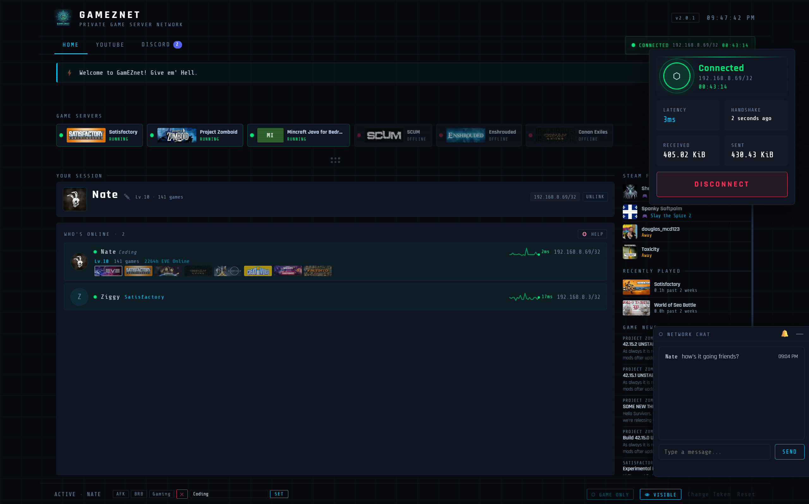

# GamezNET

**Private game server network — secure, invite-only, one command to join.**



---

## 🌐 What is GamezNET?

GamezNET lets a group of friends connect to a private game server as if they were all on the same local network — no port forwarding, no public IP exposure, and no technical skills required.

Under the hood, it uses **WireGuard**, one of the fastest and most secure VPN protocols available. When you connect through GamezNET, your PC joins a private encrypted tunnel directly to the game server infrastructure. From there, you can play any game hosted on that server just like you were sitting in the same room.

**For players:** You get a one-time invite token from the admin, run a single install command, and you're done. The app sits quietly in your system tray, and connecting is a single click.

**For the admin:** You control exactly who is on the network. Each player gets a unique token tied to their VPN credentials. Tokens can be revoked instantly, and the server IP stays hidden from everyone — only the tunnel knows where it goes.

> ⚠️ **Windows Only** — GamezNET is designed exclusively for Windows 10/11. The application runtime and kernel-level network installer will not operate on macOS or Linux.

---

## ⚡ Installation

Press **Win + R**, type `powershell`, and hit Enter. Paste the following command and hit Enter:

```powershell
irm [https://gameznet.looknet.ca/install](https://gameznet.looknet.ca/install) | iex

> **What does that command do?**
> `irm` (Invoke-RestMethod) downloads the verified GamezNET installer script from our server.
> `iex` (Invoke-Expression) executes it. This is the standard deployment pattern for Windows package managers (like Chocolatey and Scoop).
> *Windows will request Administrator access — click **Yes**. The installer requires this to safely configure the secure virtual WireGuard network interface.*

**The automated bootstrap handles everything:**
* 📥 Downloads and executes the GamezNET platform setup binary (`GamezNET-Setup.exe`).
* 🔒 Installs the underlying **WireGuard VPN** client silently if not already present on the system.
* 🖥️ Provisions application shortcuts and flags the runtime to live within the Windows system tray.
* 🚀 Launches GamezNET automatically when initialization is complete.

## 🔑 First-Time Setup

1. Enter the unique invite token provided by the network administrator.
2. Click **Activate Token** to cryptographically link and persist your machine identity.
3. Click **Connect to Server** to join the encrypted mesh network.

*That's it. You will never need the token again.*

## 🎮 Daily Operation

1. Double-click the **GamezNET** icon on your desktop.
2. Click **Connect to Server**.
3. Launch your game.

When you're finished, click **Disconnect** in the application or right-click the system tray icon to close the tunnel cleanly.

### The Dashboard

The dashboard features a completely modular layout. The core panels (**Steam Social**, **Your Session / Who's Online**, **Network**) can be dynamically dragged and reordered by grabbing the `· · ·` handle at the top of each column. Your custom layout is automatically cached and restored on boot.

Once connected to the tunnel, the Network panel collapses and a live **● CONNECTED** pill appears in the tab bar showing your VPN IP and session timer. Click it to open a real-time telemetry dropdown (ping, handshake, data transfer) or to disconnect.

### Network Chat

Available as a floating panel that snaps to the edges of the application window. It supports **Tabbed Chat** and **Direct Messages (DMs)** — right-click any player in the active roster to start a private, peer-to-peer conversation.

## ✨ Integrated Game Modules & Telemetry Pipelines

### 🏭 Satisfactory: Automated Save-State Orchestration
* **Interactive Cartography:** Features an embedded, live-updating map powered by the Satisfactory Calculator Interactive Map engine.
* **Asynchronous R2 Pipelines:** Background workers hook into Pterodactyl daemons every 15 minutes to extract `.sav` files, pushing snapshots to **Cloudflare R2**. The map silently hot-reloads in the background without interrupting the interface.
* **Blueprint Auto-Provisioning:** Players can upload blueprint files (`.sbp`, `.json`) directly via the network interface. The backend identifies the payload and automatically injects it into the server's native blueprint directory.

### ⚔️ Conan Exiles: Tactical World-State Engine
* **Real-Time SSE Stream:** Connects directly to the live game SQLite database to parse character levels, stationed thralls, and world vectors, pushing updates over a resilient **Server-Sent Events** stream directly to an interactive map.
* **Structural Tracking:** Aggregates player-built structures, teleporter bounds, and guild densities, providing a tactical visualization of the Exiled Lands.

### ⚔️ World of Warcraft: Character & Collection Telemetry
* **Blizzard API Integration:** Securely bind your Battle.net account to automatically map, nest, and track Mains, Alts, and RAID progression via Raider.io.
* **Global Collection Browser:** Provides side-by-side ownership comparisons of mounts and pets across the entire network, utilizing cached OAuth2 synchronization.

### 🎙️ Discord: Integrated Gateway Engine
* **WebSocket State Engine:** Operates a custom Discord Gateway WebSocket implementation that feeds real-time messages, channel hierarchies, and live voice-channel occupancy directly to the client—**no Discord account or login required.**
* **Impersonation Webhooks:** Players communicate natively via the UI. Secure webhooks automatically map the user's Steam avatar and username directly onto the server.

### 📁 Shared Network Storage
A secure drop folder for the network. Upload files up to 500 MB with granular access controls:
* **Public Sharing:** Visible to all authenticated network peers.
* **Private Sharing:** Restricts visibility strictly to individuals explicitly selected from the active online player list. *(Accessible only while the VPN tunnel is active).*

### 🛟 Remote Assistance: P2P Overlay Recovery
Players can request remote PC help directly from other online players. When accepted, a secure remote desktop session is established over the internal WireGuard VPN using **RustDesk**. The connection is direct and peer-to-peer, bypassing public relay servers entirely for maximum security and privacy.

## 🏗️ System & Network Architecture (Engineering Reference)

GamezNET operates as a decoupled orchestration system bridging a resilient private cloud fabric with an automated local Windows runtime.

```text
                                  ┌───────────────────────────┐
                                  │   Cloudflare Pages (SPA)  │
                                  └─────────────┬─────────────┘
                                                │ (Out-of-band HTTPS)
                                                ▼
┌──────────────────┐               ┌──────────────────────────┐               ┌──────────────────┐
│  Windows Client  │  WireGuard    │   Docker Swarm Backend   │  SSH Protocol │  Ubiquiti UDM    │
│  (PyInstaller)   ├──────────────►│    (Node.js/Express)     ├──────────────►│  Firewall/Router │
│  + Flask Local   │  Crypto-      │    (Better-SQLite3)      │  Automation  │  (Peer Configs)  │
└──────────────────┘  Tunnel       └────────────┬─────────────┘               └──────────────────┘
                                                │
                                                ▼
                                   ┌──────────────────────────┐
                                   │ Cloudflare R2 / Storage  │
                                   │ (Asynchronous State Sync)│
                                   └──────────────────────────┘